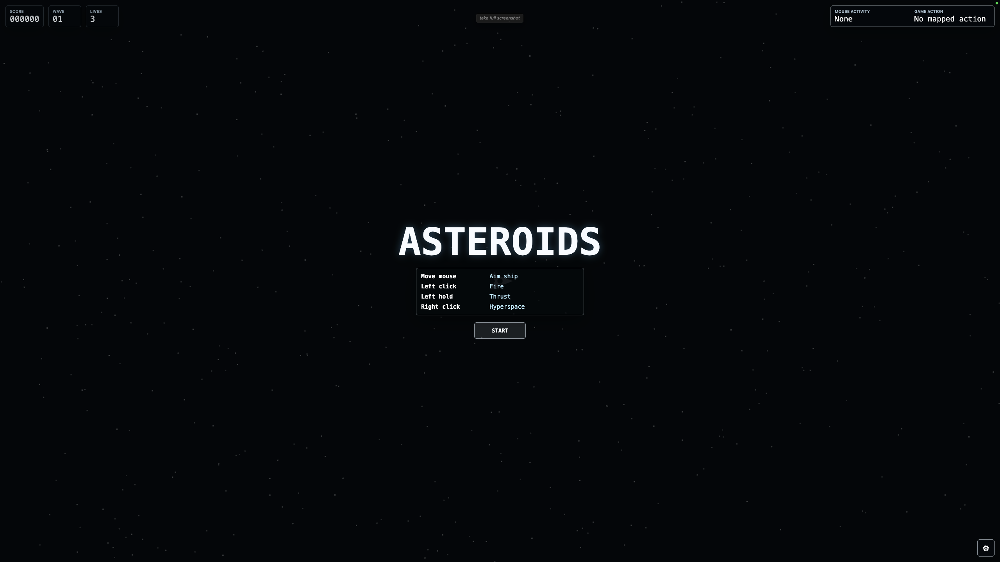
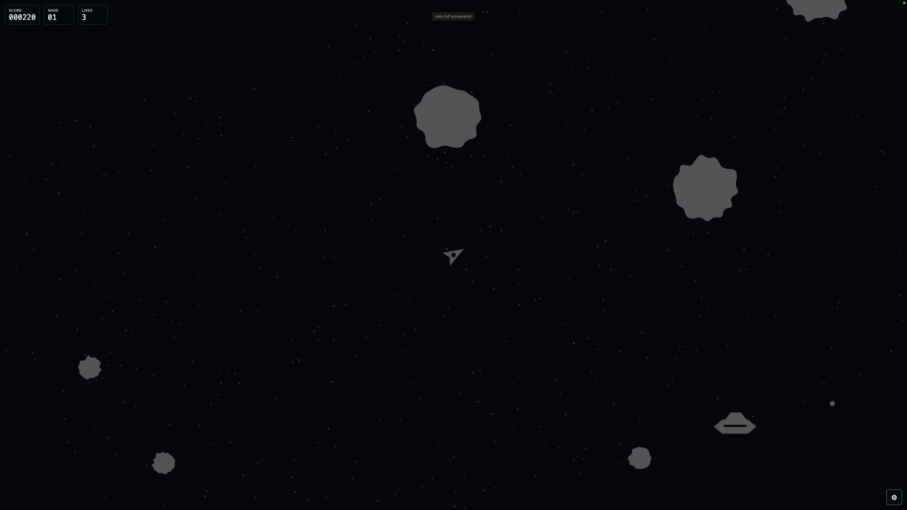
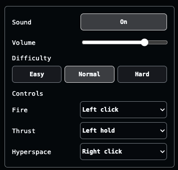

# Asteroids

A browser-based Three.js recreation of the original **Asteroids** arcade game released by Atari in 1979.

This version was designed with accessibility in mind for players who do not have the use of their hands, but can control a mouse pointer through assistive technology such as a gyroscopic head mouse, head tracking, or facial tracking. The game can be played with mouse movement and remappable mouse actions, so players can adapt Fire, Thrust, and Hyperspace to the gestures or switches that work best for them.

The game keeps the classic wraparound playfield, triangular ship, drifting asteroids, splitting rocks, flying saucers, hyperspace, extra lives, and escalating waves, while adding mouse-only controls and an accessibility-focused settings panel.

## Screenshots

Start screen:



In-game:



## Play Online

Play the game in your browser:

https://crypto69.github.io/Asteroids/

You can also download this repository and run it locally using the Python instructions below.

## How To Play

Move the mouse anywhere on the screen to aim the ship. The ship points toward the mouse position.

Before starting the game, you can test your mouse, head mouse, or facial tracking gestures. The panel at the top right of the screen shows the detected mouse activity and the game action that would be triggered by the current control mapping.


Default controls:

| Action | Default input |
| --- | --- |
| Fire | Left click |
| Thrust | Left hold |
| Hyperspace | Right click |

These mappings can be changed in the settings panel.

## Game Mechanics

Each wave begins with several large asteroids drifting across the screen. All moving objects wrap around the screen edges, so an asteroid leaving one side reappears on the opposite side.

Shooting asteroids breaks them into smaller, faster pieces:

| Asteroid size | Points |
| --- | ---: |
| Large | 20 |
| Medium | 50 |
| Small | 100 |

Large and medium asteroids split into two smaller asteroids. Small asteroids are destroyed completely.

Flying saucers appear during play. Large saucers fire inaccurately, while small saucers aim more precisely as the score increases. Saucer shots can also break asteroids, matching the original arcade behavior, but saucer-caused asteroid breaks do not award player points.

The player starts with 3 lives and earns one extra life every 10,000 points. The score is capped at 99,990.

Hyperspace moves the ship to a random location and briefly makes it invulnerable, but it has a cooldown. When the ship respawns after losing a life, it waits for or chooses a position that is not touching an asteroid.

## Settings

Open the settings panel with the gear button which appears in the bottom right hand corner of the screen.



Available settings:

| Setting | Description |
| --- | --- |
| Sound | Turns all game audio on or off. |
| Volume | Adjusts the master audio volume. |
| Difficulty | Easy slows asteroids by 30%, Normal uses standard speed, and Hard speeds asteroids up by 30%. |
| Controls | Remap Fire, Thrust, and Hyperspace to mouse click, double-click, hold, or Disabled. |

The available control inputs are:

- Left click
- Left double-click
- Left hold
- Middle click
- Middle double-click
- Middle hold
- Right click
- Right double-click
- Right hold
- Disabled

Settings are saved locally in the browser.

## Running Locally

From this folder, serve the files with any static web server. For example:

```bash
python3 -m http.server 8173 --bind 127.0.0.1
```

Then open:

```text
http://127.0.0.1:8173/
```
